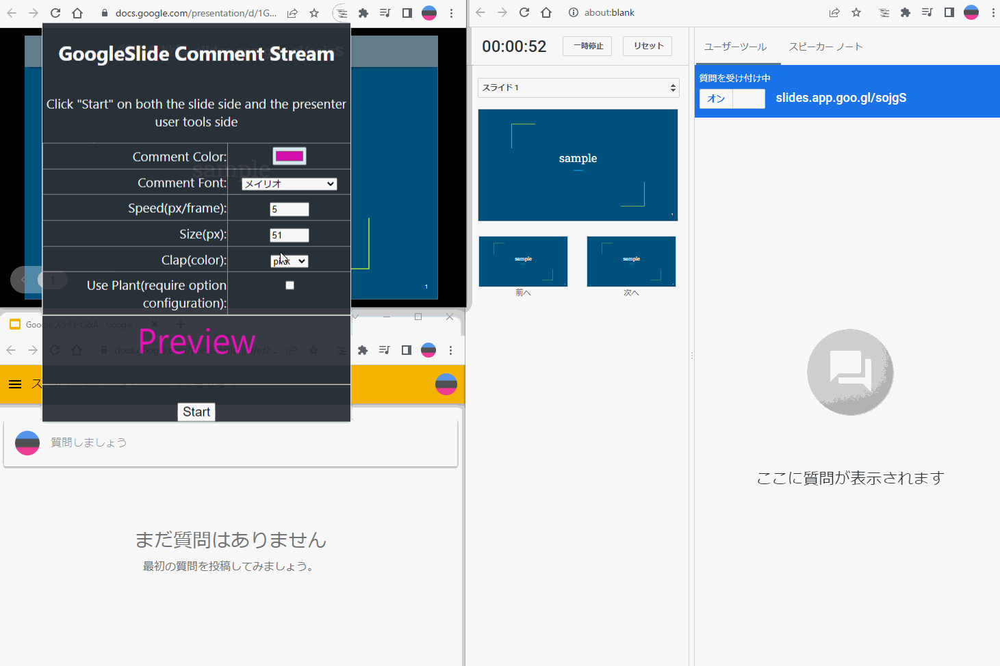
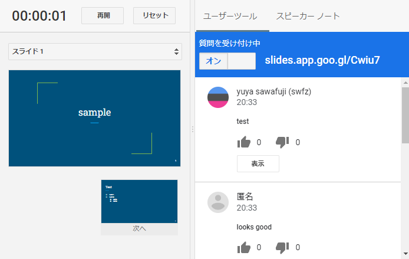

# chrome-extension-google-slide-usertool-comment-stream

Chrome Extension to flow comments posted on User Tools onto slides.

Comment data is available in the user tools included with Google Slides, so there is no need to send data anywhere, making it easy to get started at work, etc.

<!--  -->



## Install

[googleslide-comment-stream](https://chrome.google.com/webstore/detail/googleslide-comment-strea/cjhbnmagndpfjadnpbceahnccfpbmaii)

Add the extension to Chrome from the Store URL above

## How to use

| step                  | description                                                                                                                                                         | image                           |
| :-------------------- | :------------------------------------------------------------------------------------------------------------------------------------------------------------------ | :------------------------------ |
| Start Slide Show      | Click on Presenter Display                                                                                                                                          |  |
| Launch User Tools     | Click "Start a new session" on the User Tools tab to start a User Tools session in a new tab                                                                        |  |
| Access and share URLs | The URL of the user tool will be displayed on both the slide side and the presenter, and will be shared with the members listening to the presentation.             |  |
| Presenter settings    | Right-click on the title bar and press the "View in tabs" button                                                                                                    |  |
| Presenter settings    | Enter the settings for the areas you want to change from the defaults and click "Start".                                                                            |  |
| Slide settings        | The presentation slide side will also be set up. The settings are synchronized, so if you have changed the settings in the previous step, they should be reflected. |  |
| Usertool settings     | Open the Extended menu and press Start as in the above two cases.                                                                                                   |  |
| Ready to go           | When you post a comment in the User Tools, the comment will flow to the slide side                                                                                  |                                 |

## Overview

There are three screen types used in this extension: presenter slide usertool

| Presenter                          | Slide                      | Usertool                         |
| :--------------------------------- | :------------------------- | :------------------------------- |
|  |  |  |

content_script is running on each screen.

In contents_script, DOM change detection (MutationObserver) for comments and slide numbers, and messaging between screens (BroadcastChannel) are performed.

## Feature

### Normal comment flow

Audience comments on usertool

The commented content flows from right to left on the slide side.

### Clap

If you post a series of `8`, an applause effect will be displayed in the lower right corner of the screen for each successive `8` posted.


### Download


You can download the list of commented comments

Once you have started the program on the presenter screen, click the "DownloadComments" button.

You can download the list of comments in json format.

- usertool-comments.json

```json
[
  {
    "user": "user1",
    "time": "20:11",
    "text": "sample comment"
  },
  {
    "user": "user1",
    "time": "20:11",
    "text": "foo"
  },
  {
    "user": "user1",
    "time": "20:11",
    "text": "bar"
  },
  {
    "user": "user1",
    "time": "20:11",
    "text": "88888888888"
  }
]
```

### Sakura

Ability to set comments to be broadcast in advance by yourself

You can control the reactions you want on specific slides and the flow of your presentation

Settings are made in `options

- key: slide page number
- seconds: number of seconds after page transition
- comment: comment to post

You can set the number of seconds after which slide number the comment will be posted.


The comment will be posted automatically as you advance through the slides.


## development

```shell
yarn dev
```

load `dist` directory with "Load Unpackaged Extensions"
