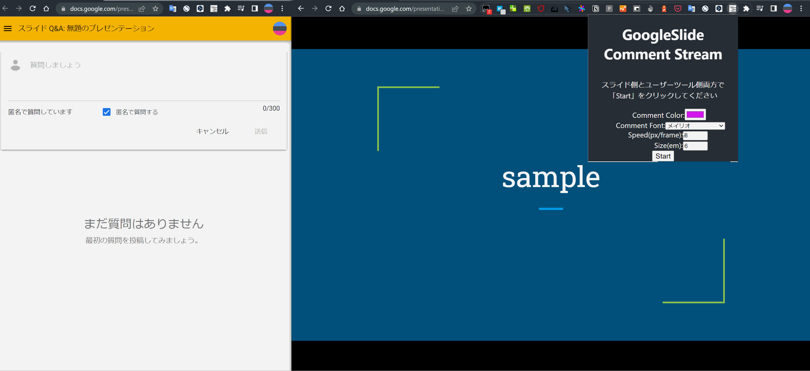

# chrome-extension-google-slide-usertool-comment-stream

Chrome Extension to flow comments posted on User Tools onto slides.



## install

- download

Download [googleslide-comment-stream-v2.0.2.tar.gz](https://github.com/swfz/chrome-extension-google-slide-usertool-comment-stream/releases/download/v2.0.2/googleslide-comment-stream-v2.0.2.tar.gz)

- unzip

```shell
tar -zxvf googleslide-comment-stream-v2.0.2.tar.gz
```

- upload

Unzip it and load it with "Load Unpackaged Extensions"

## development

```shell
yarn dev
```

load `dist` directory with "Load Unpackaged Extensions"
