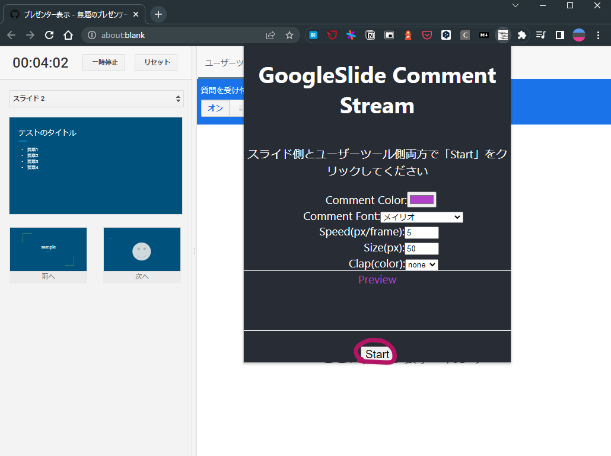

# chrome-extension-google-slide-usertool-comment-stream

Chrome Extension to flow comments posted on User Tools onto slides.


## Install

[googleslide-comment-stream](https://chrome.google.com/webstore/detail/googleslide-comment-strea/cjhbnmagndpfjadnpbceahnccfpbmaii)

Add the extension to Chrome from the Store URL above

## How to use

### Start Slide Show

Click on Presenter Display


### Launch User Tools


Click "Start a new session" on the User Tools tab to start a User Tools session in a new tab

### Access and share URLs


The URL of the user tool will be displayed on both the slide side and the presenter, and will be shared with the members listening to the presentation.

### Presenter side settings


Right-click on the title bar and press the "View in tabs" button



Enter the settings for the areas you want to change from the defaults and click "Start".

### Presentation side settings


The presentation slide side will also be set up.


The settings are synchronized, so if you have changed the settings in the previous step, they should be reflected.

### Ready to go


When you post a comment in the User Tools, the comment will flow to the slide side

## Extra(Clap)

If you post a series of `8`, an applause effect will be displayed in the lower right corner of the screen for each successive `8` posted.


## development

```shell
yarn dev
```

load `dist` directory with "Load Unpackaged Extensions"
