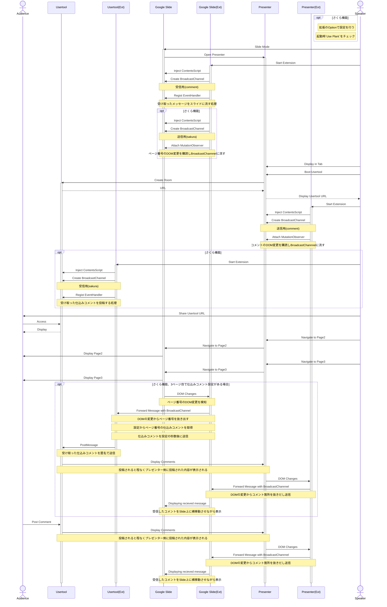

# Document

自分が思い出すためのドキュメント

以下3種類のページに対して拡張機能をONにする必要がある

- Presenter
  - ページ送りとかカンペとかが見える画面
- Slide
  - 発表スライド
- Usertool(さくら機能を使うときは必要)
  - 聴講者がコメントを投稿する画面

## やり取りの流れ

Extは各ページで動作する拡張（ContentsScript）

